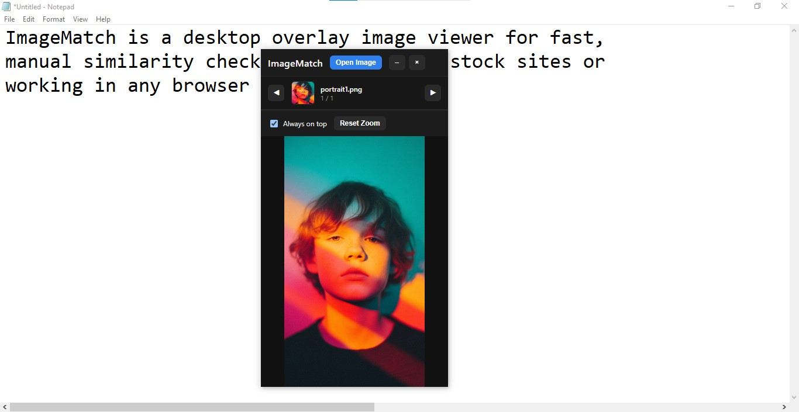

# ImageMatch

Floating always-on-top image window for manual similarity checks.



## Features

- Always-on-top, borderless, resizable window
- Open multiple images and swipe with arrows
- Drag & drop images
- Zoom with mouse wheel
- Toggle always-on-top

## Run

```powershell
npm install
npm run start
```
